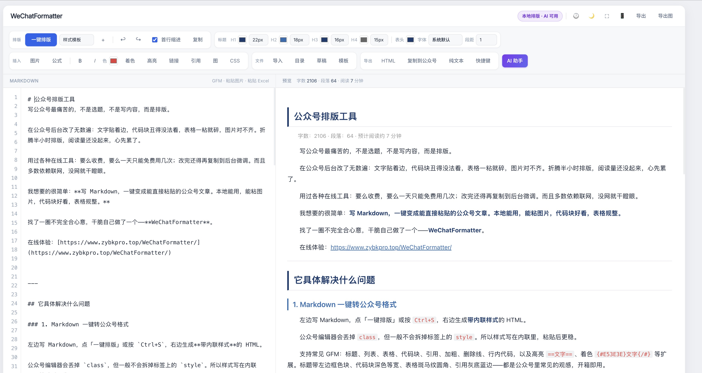
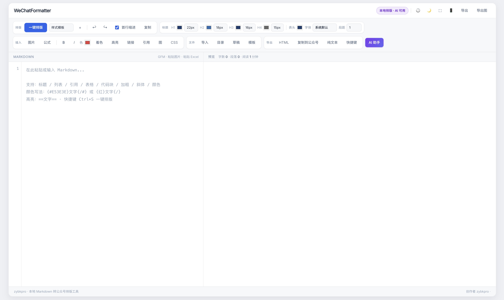
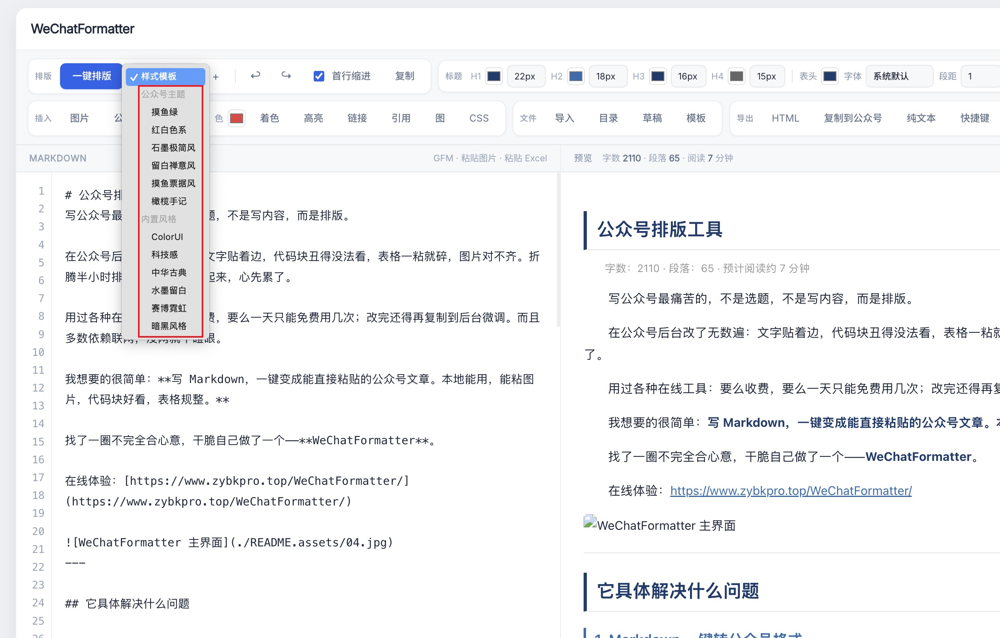
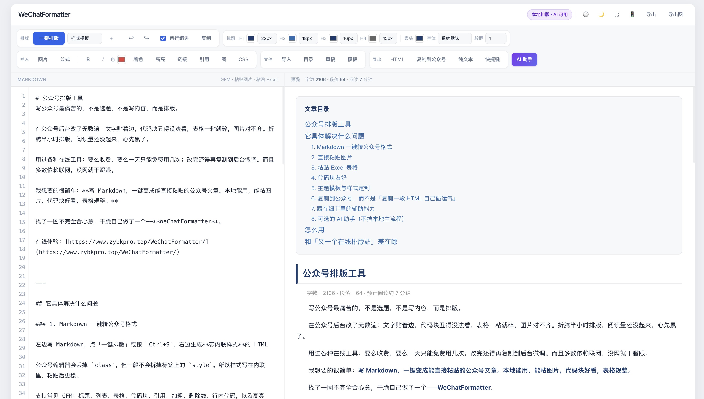
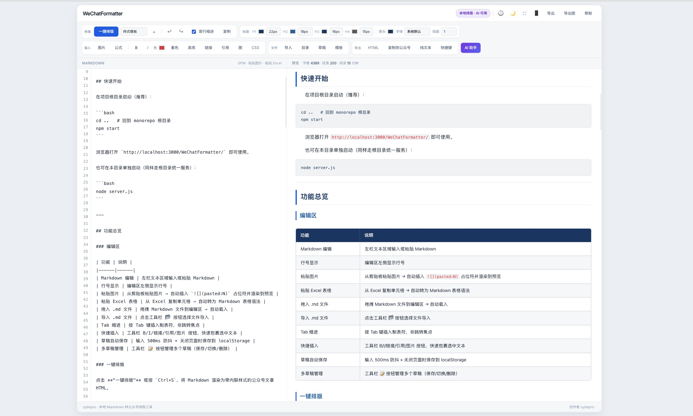

<div align="center">

# Markdown Editor

A Markdown writing tool that works right out of the box in your browser.
**No installation. No account. No subscription. Your words belong to you.**

[](LICENSE)[](./index.html)[](./i18n.js)

<p align="center">
  <a href="./README.md" style="display:inline-block;padding:6px 18px;background:#4f46e5;color:#fff;border-radius:6px 0 0 6px;text-decoration:none;font-weight:600;">English</a>  |  <a href="./README.zh.md" style="display:inline-block;padding:6px 18px;background:#f3f4f6;color:#4b5563;border-radius:0 6px 6px 0;text-decoration:none;font-weight:600;">简体中文</a>
</p>

</div>

<p align="center">
  
</p>

---

## 🌟 Why This Tool?

In the age of AI, Markdown should be simple enough.

As a Vibe Coding developer obsessed with Prompts, Agents, and Skills, I’ve used too many Markdown tools: some are too heavy, some charge subscriptions, and some sync your content to the cloud without asking. I just wanted to open a browser, type, see the layout, and take it away.

So I built this editor.

It is a browser-first toolkit: open `index.html` to write, everything stays local, and it works offline. It supports nearly all mainstream Agents — Codex, Claude Code, Openclaw, and more. For WeChat Official Account typesetting, switch to `WeChatFormatter/`.

> If you also believe that in the age of AI, Markdown is the first language — welcome to use it, fork it, and star it.

---

## ✨ Features

### 🚀 Out-of-the-Box, Minimalist

- Open `index.html` in the browser, or run `npm start` to host the full toolkit locally.
- Core dependencies are vendored under `public/vendor/` for offline use.
- Includes WeChat formatter at `WeChatFormatter/`.

### 🖊️ Complete Markdown Experience

- **Drag-and-drop import**: drop files directly into the window.
- **Live preview**: write on the left, preview on the right in real time.
- **Multiple layouts**: edit + preview, edit only, or preview only.
- **Source mode**: edit raw Markdown directly on the right side.
- **Draggable split**: adjust the editor/preview ratio; position is remembered.

### 🛠️ Rich Editing Tools

| Feature | Description |
|---------|-------------|
| Headings | Quick H1-H6 insertion |
| Text styles | Bold, italic, underline, strikethrough, superscript, subscript |
| Lists | Unordered, ordered, and task lists |
| Quotes & code | Blockquotes, inline code, fenced code blocks |
| Links & images | URL insertion and local image Base64 embedding |
| Tables | Visual 8×8 table picker |
| Find & replace | Find next, replace, replace all |

### 🌐 Multi-Language Support (10 Languages)

Powered by `i18n.js`: **Simplified Chinese, Traditional Chinese, English, Japanese, Korean, Spanish, French, German, Russian, Portuguese**.

Language preference is persisted to `localStorage`.

### 🎨 Dark / Light Theme

- One-click theme switching with automatic persistence.
- All colors use CSS variables, making customization easy.

### 💾 Local Auto-Save

- Auto-saves content to browser `localStorage` every 500ms.
- Content, filename, split ratio, collapsed states, theme, and language all survive page refresh.

### 📤 Multi-Format Export

| Format | Description |
|--------|-------------|
| `.md` | Raw Markdown file |
| `.html` | Standalone HTML file |
| `.doc` | Word document (opens directly in Office) |
| `.pdf` | Browser print-to-PDF |
| `.png` | Long-image export with 9:16, 4:5, 3:4, 1:1, 16:9 ratios for social sharing |

### ⌨️ Shortcuts

| Shortcut | Action |
|----------|--------|
| `Ctrl + S` | Save |
| `Ctrl + Z` | Undo |
| `Ctrl + Y` / `Ctrl + Shift + Z` | Redo |
| `Ctrl + B` | Bold |
| `Ctrl + I` | Italic |
| `Ctrl + U` | Underline |
| `Ctrl + K` | Insert link |
| `Ctrl + Shift + K` | Insert image |
| `Ctrl + F` | Find & replace |
| `Tab` | Insert 4-space indent |

---

## 🛠️ Technical Architecture

### Stack

- **Pure native frontend**: HTML5 + CSS3 + Vanilla JavaScript, no framework.
- **Markdown rendering**: `marked.js`
- **Math**: `KaTeX` (`$...$` inline, `$$...$$` block)
- **Diagrams**: `Mermaid 10` (mind maps and flowcharts)
- **Image export**: `dom-to-image-more`
- **WeChat typesetting**: `WeChatFormatter/` (inline-style HTML for Official Accounts)
- **Local proxy**: `Python 3` (optional, for webpage-to-Markdown)

### Core Design

```
┌─────────────────────────────────────────────────────────────┐
│                         index.html                          │
│  ┌──────────────┐         ┌──────────────┐                  │
│  │  Editor      │  sync   │  Preview     │                  │
│  │  (textarea)  │ ──────▶ │  (marked.js) │                  │
│  └──────────────┘         └──────────────┘                  │
│         │                         │                         │
│         ▼                         ▼                         │
│   localStorage               KaTeX / Mermaid               │
└─────────────────────────────────────────────────────────────┘
                              │
              ┌───────────────┴───────────────┐
              ▼                               ▼
     WeChatFormatter/ (WeChat)              web-to-md-proxy.py
```

---

## 📁 Project Structure

```
.
├── index.html                 # Markdown editor (main)
├── i18n.js                    # i18n dictionary (10 languages)
├── server.js                  # Unified local static server
├── public/                    # Editor CSS / JS / vendor libs
├── WeChatFormatter/                 # WeChat Official Account formatter
│   ├── index.html
│   ├── app.js
│   ├── config/
│   └── utils/
├── scripts/                   # build / deploy
└── README.md
```

---

## 🌐 Live Demo

- **mdEditor**: https://www.zybkpro.top/mdEditor/
- **WeChatFormatter**: https://www.zybkpro.top/WeChatFormatter/

## 🚀 Quick Start

```bash
npm start
```

Then open:

- Landing: http://localhost:3000/index/
- Editor: http://localhost:3000/mdEditor/
- WeChat formatter: http://localhost:3000/WeChatFormatter/

Or open `mdEditor/index.html` / `WeChatFormatter/index.html` directly in the browser.

### Option 3: Use the Local Proxy (Webpage to Markdown)

```bash
# Install requests (optional, recommended)
pip install requests

# Start the proxy
python web-to-md-proxy.py

# Default port 8765
# Check "Use local proxy" in the editor
```

---

## 🖼️ Screenshots

<p align="center">
  
  
</p>

<p align="center">
  
  
</p>

---

## 🤝 Contributing

This project started from my own need for a simple writing tool, but I believe it can be better.

New features, bug fixes, UI improvements, language additions, and documentation improvements are all welcome:

1. Fork the repository
2. Create your feature branch: `git checkout -b feature/AmazingFeature`
3. Commit your changes: `git commit -m 'Add some AmazingFeature'`
4. Push to the branch: `git push origin feature/AmazingFeature`
5. Open a Pull Request

---

## 📜 License

This project is licensed under the [MIT License](LICENSE).

You are free to use, modify, and distribute. For commercial use, please obtain authorization. I only hope that one quiet afternoon, when you write something you are truly satisfied with, you might remember where this little tool began.

---


---

<div align="center">

### If this helps you, please give it a ⭐.

**Writing well is what matters most.**

</div>
